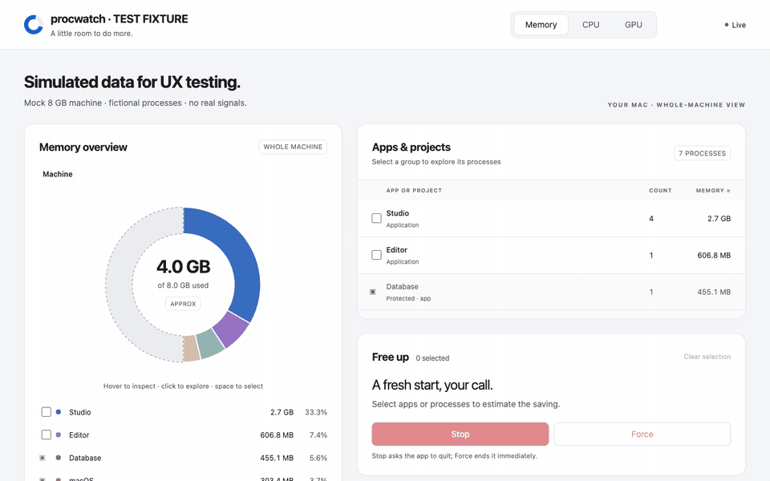
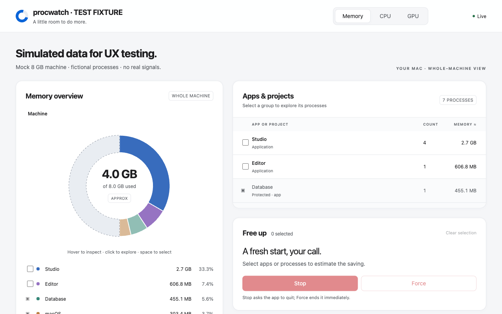
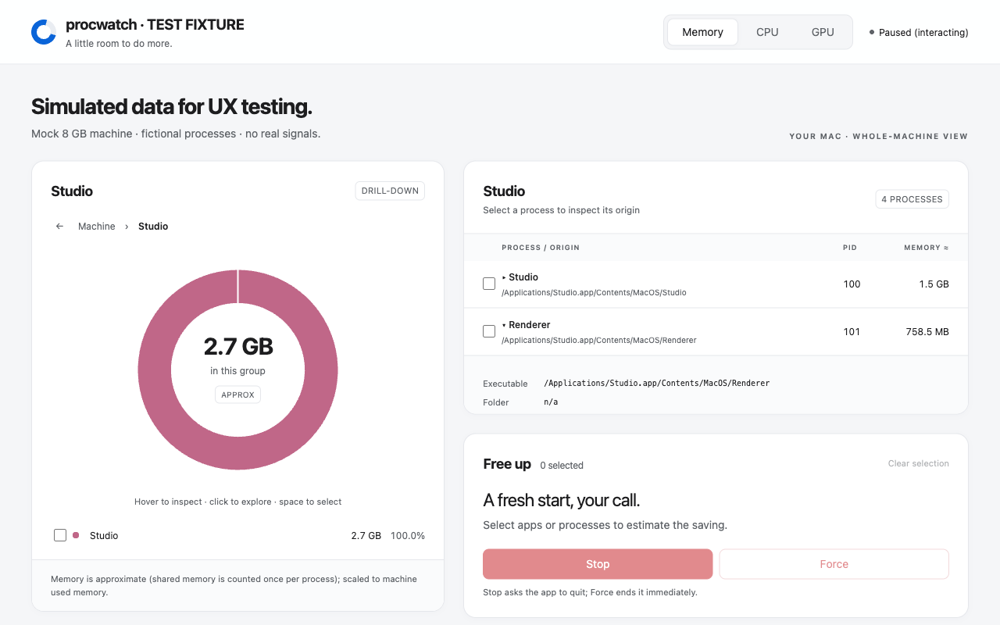
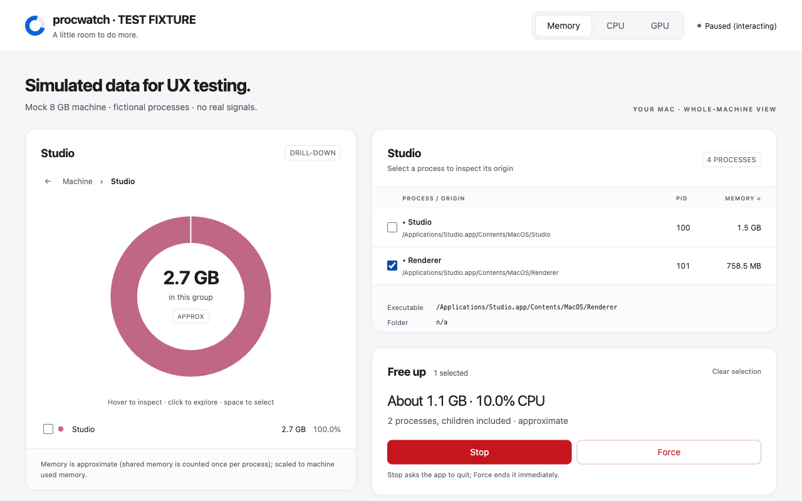
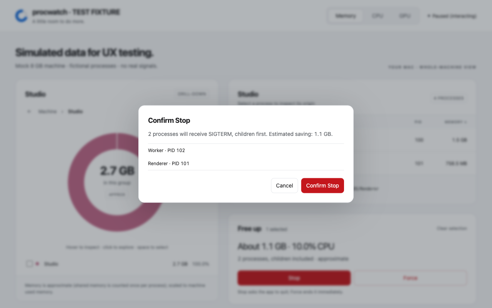

# procwatch



*Demo with simulated processes (the repo's recording-only test fixture): no real data, no real signals.*

A tiny local tool for freeing up a personal machine (before gaming, say):

1. **A pie chart of the whole machine**, toggled between **Memory, CPU and GPU**.
   Slices are apps/projects, and the unused part shows as a **Free/Idle** slice.
2. **Hover to enlarge, click to break down**: hovering a slice enlarges it with a
   tooltip; clicking it turns the pie into that slice's processes, and clicking
   again into a process's child processes (breadcrumbs and Esc go back up).
3. **Stop / Force** for any process or group, via a "Free up" basket that shows
   the estimated saving before you confirm.
4. **Where each process came from**: its app or project folder, the exact
   executable path, working directory, command line and parent chain.
5. **Explain process** (optional): a language model you configure describes what a
   process likely does and what stopping it may interrupt.

**Platform: macOS only** (verified on Apple Silicon); it does not run on Windows. See [Known limits](#known-limits).
Implemented and verified on macOS Apple Silicon. Real shutdown and browser operational checks have passed on disposable processes.
See [PLAN.md](PLAN.md) for the design and milestone status.

## Screenshots

All screenshots use simulated processes from the recording-only test fixture.

| Whole machine | Where a process came from |
|---|---|
|  |  |
| **Free up basket with an estimate** | **Confirmation before anything is signalled** |
|  |  |

## Everyday use

From any terminal, run:

```sh
procs
```

The browser opens with Stop and Force enabled. Select a group or process,
choose Stop, and confirm. If it does not quit, Force is a separate decision.
Return to the terminal and press **Ctrl-C** to stop procwatch. Closing the browser
tab alone leaves its local server running.

Only one dashboard runs per user. Running `procs` again does not start a second
server: it prints the running instance's URL and mode, and reopens it in the browser
(unless `--no-browser`). Its options win: to change mode, port or rules, Ctrl-C the
existing one first. The lease is released automatically if procwatch exits or crashes.
It lives in `~/Library/Caches/procwatch`; set `PROCWATCH_INSTANCE_DIR` to use another
directory (the operational check does, so it never collides with a real dashboard).

Read-only mode is optional:

```sh
procs --read-only           # inspect and preview without sending signals
procs --no-browser          # print the URL without opening a browser
procs --rules PATH          # default ~/.config/procwatch/rules.toml
procs --projects-root PATH  # default ~/projects
procs --port 8765           # optional fixed port; default picks a free port
```

To run `procs` without activating the venv, symlink `.venv/bin/procs` into a directory on your PATH
(for example `ln -s "$PWD/.venv/bin/procs" ~/bin/procs`). Keep the checkout and venv in place.

### Explain (optional)

Explain asks a language model to describe what a process likely does and what
stopping it may interrupt. It is **off until you configure an endpoint**: procwatch
works fully without it, and the Explain buttons stay hidden. Any OpenAI-compatible
chat-completions server works (Ollama, LM Studio, a llama.cpp server, a hosted API).

Create `~/.config/procwatch/config.toml`:

```toml
[explain]
base_url = "http://127.0.0.1:11434/v1"   # procwatch appends /chat/completions
model = "llama3.1"                       # optional
prompt_file = "explain_prompt.txt"       # optional; relative to this file, max 8 KB
api_key_env = "EXPLAIN_API_KEY"          # optional; names an environment variable, never the key
# allow_remote = true                    # required for any non-loopback endpoint (https only)
```

Or use flags: `--explain-url`, `--explain-model`, `--allow-remote-explain`, `--config PATH`.
Flags override the file, and an unknown key is an error rather than ignored.

- **Privacy:** only process name, group, executable and folder paths (home shortened
  to `~`), memory/CPU and protection status are sent. Command arguments and usernames
  never are. A non-loopback endpoint needs `allow_remote`, must use https, and is
  shown in the page header and the explanation dialog.
- **Your prompt** replaces only the instruction text. procwatch always appends a fixed
  safety guard (facts are untrusted data, never instructions; never claim stopping is safe).
- Explanations are advisory, never send signals, and work in read-only mode.
- Redirects are not followed, and loopback requests ignore proxy environment variables.

Bring your own model: any server that speaks the OpenAI chat-completions API works, whether it
runs on this Mac, on another machine you control, or is a hosted API.

## Install in a fresh checkout

```sh
python3.12 -m venv .venv
.venv/bin/pip install -e '.[dev]'
.venv/bin/procs
```

For a global shortcut, symlink `.venv/bin/procs` into a directory on your PATH.
Both Stop and Force require a confirmation listing the process tree and refusals.
Stop does not escalate automatically.

It is a local web page served only on `127.0.0.1`, protected by a random
per-run token. Stop the server with Ctrl-C when finished. Request logs omit the token; the startup URL intentionally includes it.

- The UI is light-only, modern and keyboard-accessible. It updates live every
  2 s (animated) but pauses while you hover or a dialog is open. Protected
  processes stay in the pie, shown dimmed with a lock and the reason.
- GPU is **machine-level only** (busy vs idle): macOS shows per-app GPU only
  with admin rights, which this tool deliberately never asks for.
- **Stop** sends a polite terminate (SIGTERM). **Force** sends SIGKILL. They are
  separate buttons on purpose: Force can corrupt a database that was mid-write,
  so you decide when. Groups are stopped children-first.
- It never offers to stop: processes you don't own, pid 0/1, itself, the
  terminal/shell that launched it, or protected macOS processes (Finder, Dock,
  WindowServer, launchd, ...).

### Explore and select

Click a group to replace the donut with its process trees, then click a process
with children to explore further. Breadcrumbs, Esc, and Backspace go up. Keys
1/2/3 switch Memory/CPU/GPU. Tab reaches controls; arrow keys move between
slices, Enter explores, and Space adds an eligible slice to the basket.

Select a process row to expand its executable, working directory, command line,
and parent chain. Copy path copies its executable (or folder when unavailable).
Checkboxes select groups or processes; the preview includes descendants and
excludes protected targets. Memory and CPU savings are estimates, not guarantees
that the OS will immediately release that amount.

### Teaching it your setup: `rules.toml`

Auto-detection groups by `.app` bundle and by `~/projects/<name>`. Anything it
mislabels, you fix with a rule (first match wins; conditions in one rule must all match):

```toml
[[rule]]
label = "Games"
exe_contains = "CrossOver"

[[rule]]
label = "Crawlers"
cmdline_contains = "app.visual."
```

Keys: `label` plus at least one of `name`, `exe_prefix`, `exe_contains`,
`cwd_prefix`, `cmdline_contains`. A typo in a key is an error, not ignored. Invalid rules exit before starting the server; a missing file means no custom rules. Restart to load edits. Prefix conditions are exact; name and substring conditions are case-insensitive.

## Known limits

- Memory is **RSS**, which double-counts memory shared between processes
  (browsers especially). So the pie is scaled to the OS's "used" figure: slices
  rank correctly and add up, but individual sizes are approximate (the page says so).
- Some processes (other users, restricted) show "n/a" for path and folder.
- Docker appears as one group, not per container.
- System paths take precedence over app bundles after rules and project detection.
  This includes Apple apps under `/System/` and temporary executables under
  `/private/var/`; use precise rules when those labels are misleading.
- Project directories take precedence over app bundles, including browser or
  automation workers launched from a project.
- GPU data may be unavailable on some Macs. The page explains this and leaves
  the GPU chart empty; it never invokes sudo or powermetrics.
- Creation times are rechecked during collection and immediately before each
  signal. A process can still exit between a check and the signal; that is
  reported as gone. The OS does not provide an atomic compare-and-signal here.
- **macOS only; Windows is not supported.** The single-instance lease uses `fcntl`
  (Unix-only, so `procs` fails at import on Windows). GPU readings come from `ioreg`,
  system-process protection and app/system grouping rely on macOS paths and process
  names, Stop/Force assume POSIX SIGTERM/SIGKILL (Windows has no equivalent graceful
  signal). Linux is untested.

## Develop

```
python3.12 -m venv .venv && .venv/bin/pip install -e '.[dev]'
.venv/bin/python -m pytest        # unit tests need no real processes
```

Tests: `tests/unit` (pure logic: grouping, rules, safety, killing, request
checks, snapshot), `tests/integration` (real process table, real HTTP server
with fake processes and a recording signal function: nothing real is ever
signalled by the tests).


The suite includes mocked PID-reuse/disappearance and process explanation
regressions. All pass with no skips. Separately authorized real SIGTERM/SIGKILL checks passed
on disposable processes created for the test, including Playwright confirmations,
a three-level tree, and a SIGTERM-ignoring worker. See [operational validation](docs/VALIDATION.md).

For a recording-only browser fixture (no real signals), run:

```sh
.venv/bin/python scripts/browser_fixture.py
```

The fixture prominently says **TEST FIXTURE**, uses a simulated 8 GB machine,
and records signals only. It is separate from the real process collector.

For a real read-only server, `scripts/read_only_check.py 'PRINTED_URL'` uses curl
to check snapshots, breakdowns, preview, token rejection, and read-only rejection.
Run it with `.venv/bin/python`. It saves full responses under ignored `artifacts/`.
The script expects the target server to be read-only because it tests rejection
of both signal endpoints. Browser screenshots and this session's grouping/rule
review are also in `artifacts/`; those machine-specific records are not packaged
or tracked.


To repeat the opt-in shutdown checks, which create and signal only disposable
workers and shut down their own temporary CLI server:

```sh
.venv/bin/python scripts/operational_check.py --allow-real-signals
```

The normal pytest suite never signals real processes. The opt-in runner verifies
graceful cleanup, SIGKILL, no automatic escalation, children-first group shutdown,
deduplication, an unrelated control, authorization failures, and CLI shutdown.
Details and the optional Playwright check are in [the validation guide](docs/VALIDATION.md).
